# BioClima

Aplicación web SPA de clima desarrollada con Vue 3, Vite, Pinia, Vue Router y SCSS.
Incluye consumo en tiempo real de la API de OpenWeather, estadísticas semanales, alertas meteorológicas, preferencias persistentes, ciudades recientes, ciudad favorita y autenticación con rutas protegidas.
El proyecto combina una interfaz moderna con arquitectura escalable y un flujo completo de consulta meteorológica.

Diseñada como proyecto final del Bootcamp Front End Trainee – Talento Digital para Chile.

## 🔗 Repositorio público

- GitHub: https://github.com/Vanne-TD/Weather-app-frontend.git

## ✨ Funcionalidades clave

- Búsqueda de ciudades en tiempo real
- Clima actual con temperatura, sensación térmica, humedad y viento
- Pronóstico extendido y alertas climáticas
- Estadísticas semanales dinámicas
- Alertas meteorológicas automáticas
- Cambio entre unidades métricas e imperiales
- Ciudades recientes y ciudad favorita
- Arquitectura CITY → ID para consultas estables
- Modo claro/contrast y diseño responsive
- Autenticación con sesión persistente en localStorage
- Rutas protegidas para favoritos y preferencias
- Formulario de contacto y vistas informativas del proyecto

## 🧰 Tecnologías utilizadas

- Vue 3 + Composition API
- Vite
- Vue Router
- Pinia
- SCSS con arquitectura 7-1
- Bootstrap 5
- OpenWeather API

## 🏗️ Arquitectura y estructura del proyecto

La app sigue una arquitectura modular basada en Vue 3 + Pinia + Vue Router, organizada para separar responsabilidades entre vistas, componentes, estado global y servicios de API.

### Flujo de arquitectura

1. El usuario interactúa desde la vista principal.
2. La vista consulta la API de clima a través del store.
3. El store gestiona el estado global: clima actual, pronóstico, estadísticas, alertas, unidades y preferencias.
4. Los componentes visuales reciben esos datos y los muestran en la interfaz.
5. La navegación entre vistas se gestiona con Vue Router.

### Estructura de carpetas

```text
src/
├── api/
│   └── weatherApi.js            # Lógica de consumo de la API de OpenWeather
├── assets/
│   └── styles/                  # Estilos SCSS organizados por módulos
├── components/                  # Componentes reutilizables de UI
│   ├── WeatherCardComponent.vue
│   ├── WeatherDetailsCardComponent.vue
│   ├── WeatherWeeklyComponent.vue
│   ├── NavbarComponent.vue
│   ├── RecentCitiesComponent.vue
│   └── ContactFormComponent.vue
├── layout/                      # Layouts generales de la app
│   ├── HeaderLayout.vue
│   ├── FooterLayout.vue
│   └── MainLayout.vue
├── router/
│   └── index.js                 # Definición de rutas y guards
├── stores/
│   ├── weatherStore.js          # Estado global del clima
│   └── userStore.js             # Estado global del usuario y preferencias
├── views/                       # Vistas principales de la SPA
│   ├── HomeView.vue
│   ├── DetailsView.vue
│   ├── AboutView.vue
│   ├── ContactView.vue
│   ├── FavoritesView.vue
│   ├── LoginView.vue
│   ├── PreferencesView.vue
│   └── RegistroView.vue
├── App.vue                      # Componente raíz
└── main.js                      # Punto de entrada de la app
```

### Lógica de datos

- La búsqueda de ciudades sigue un flujo de City → ID:
  - se consulta la ciudad por nombre,
  - se obtiene su identificador,
  - y luego se usan ese ID para obtener clima actual y pronóstico.
- El store centraliza:
  - clima actual,
  - pronóstico semanal,
  - estadísticas,
  - alertas,
  - unidades,
  - ciudades recientes,
  - favoritos y preferencias de usuario.

### Patrón de diseño aplicado

- Componentes reutilizables para UI y tarjetas de información.
- Stores centralizados para manejar estado compartido.
- Rutas protegidas para vistas privadas.
- Estilos SCSS organizados para mantener el proyecto escalable.

## 🚀 Requisitos previos

- Node.js 22.18.0 o superior
- npm (o pnpm, si prefieres)
- Una cuenta y API key de OpenWeather

## ▶️ Ejecución local

1. Clona el repositorio:

```bash
git clone https://github.com/Vanne-TD/Weather-app-frontend.git
cd Weather-app-frontend

```

2. Instala las dependencias:

```bash
npm install
```

3. Crea tu archivo local de variables de entorno a partir del ejemplo:

```bash
cp .env.example .env
```

Luego agrega tu clave de la API en `.env`:

```env
VITE_WEATHER_API_KEY=tu_api_key_aqui
```

> Si la variable no está configurada, la app no podrá consultar los datos del clima.

4. Inicia el servidor de desarrollo:

```bash
npm run dev
```

5. Abre la URL que indique Vite en tu navegador, normalmente:

```text
http://localhost:5173
```

6. Para generar una build de producción:

```bash
npm run build
```

## 🧭 Rutas principales

- `/` – Home
- `/detalle/:city` – Detalle del clima de una ciudad
- `/about` – Información del proyecto
- `/contacto` – Formulario de contacto
- `/login` – Inicio de sesión
- `/registro` – Registro de usuario
- `/favoritos` – Vista protegida con ciudades guardadas
- `/preferencias` – Ajustes de alertas y unidades

## ✅ Cumplimiento de la pauta

- SPA en Vue con rutas y navegación protegida.
- Consumo de API real de OpenWeather con `fetch`.
- Manejo de estado global con Pinia.
- Estado de carga y mensajes de error visibles para el usuario.
- Cálculo de estadísticas semanales y alertas meteorológicas automáticas.
- Vista principal, vista de detalle y vistas extra para favoritos, preferencias, login y contacto.
- Documentación lista para publicar en GitHub y ejecutar en local.

## 🔧 Mejoras aplicadas tras feedback

- Se reforzó la gestión de variables de entorno con `.env` local y `.env.example` versionado.
- Se centralizó el uso de API key en la capa de API para evitar referencias directas en vistas.
- Se mejoró el flujo de alertas para mostrar estado incluso cuando no hay alertas activas.
- Se añadieron umbrales de alertas configurables desde la vista de preferencias y persistencia en LocalStorage.
- Se extrajo un composable reutilizable para cargar clima por ciudad, reduciendo duplicación entre vistas.

## 🌦️ Qué incluye la app

- API de clima: OpenWeather
- Estadísticas semanales calculadas dinámicamente
- Alertas visuales según condiciones del pronóstico
- Preferencias del usuario para unidades y alertas
- Gestión de favoritos y ciudades recientes

## 📸 Capturas de la aplicación

### Home
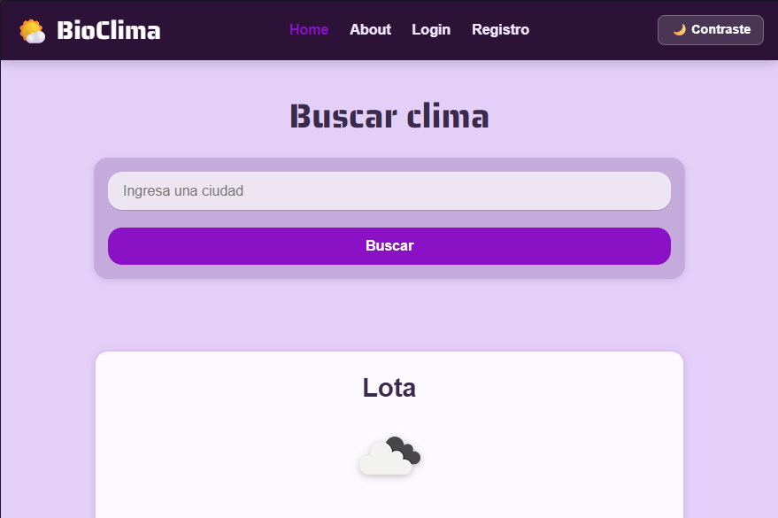

### Home con card de clima
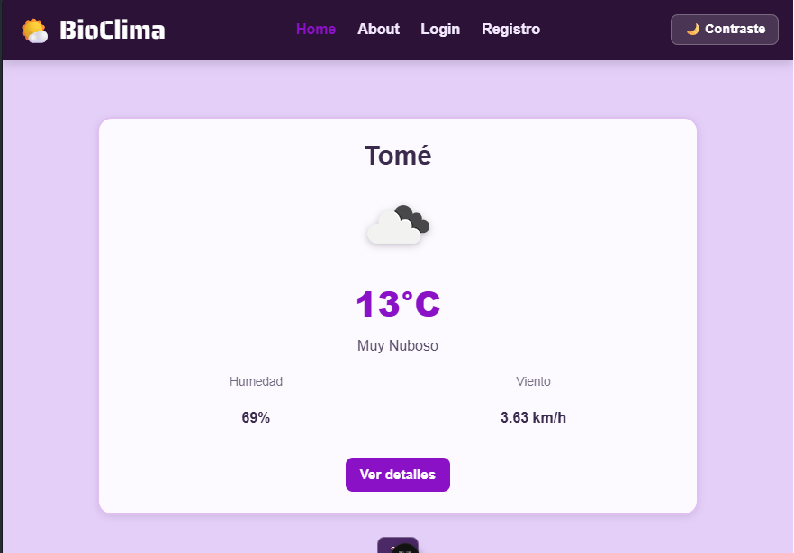

### Home con manejo de error
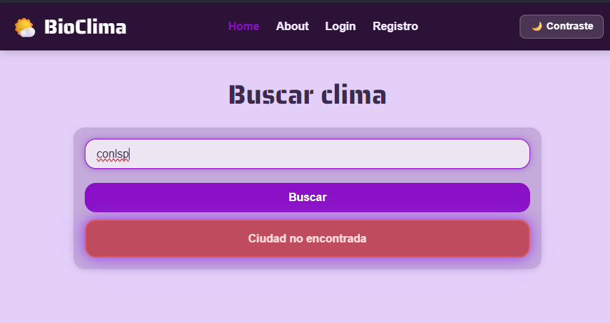

### Detalle y pronóstico
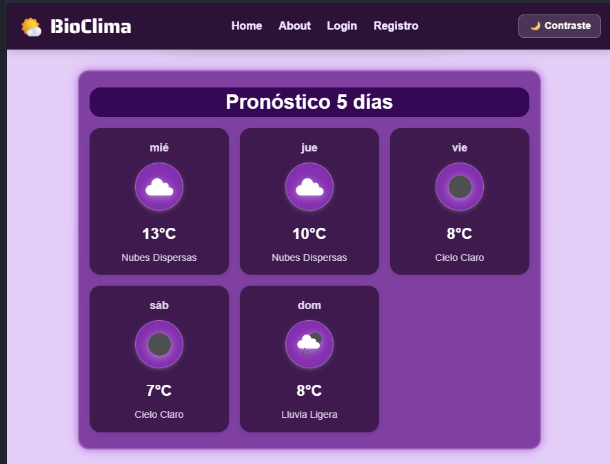

### Detalle con estadísticas y alertas
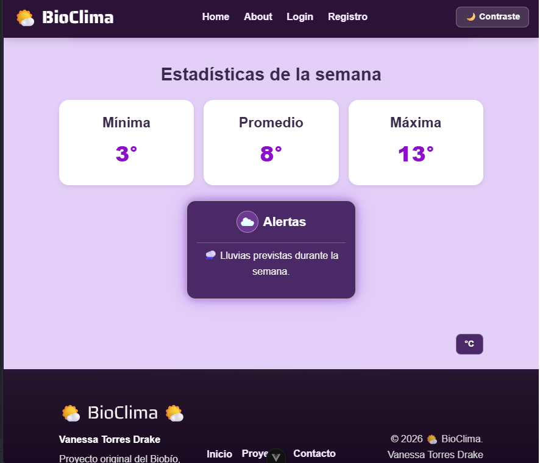

### Favoritos
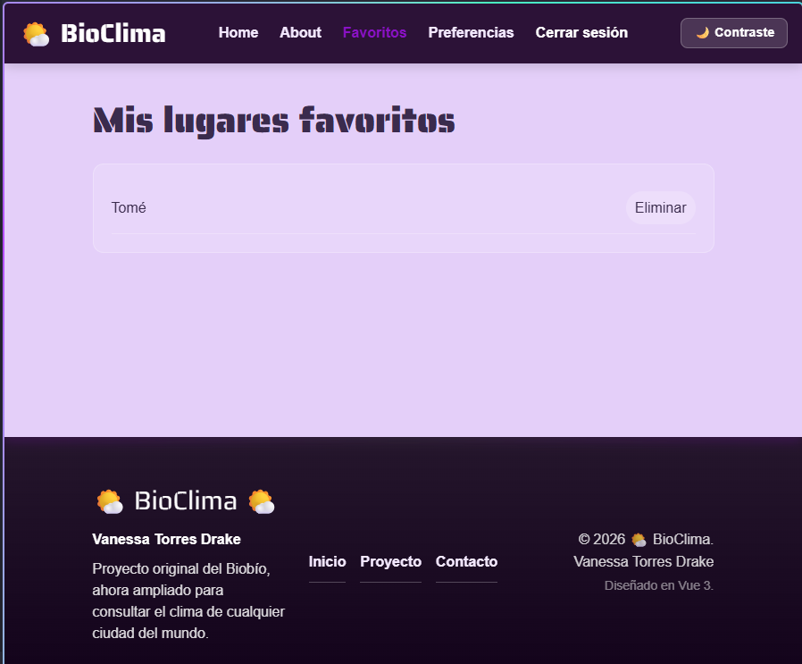

### Preferencias
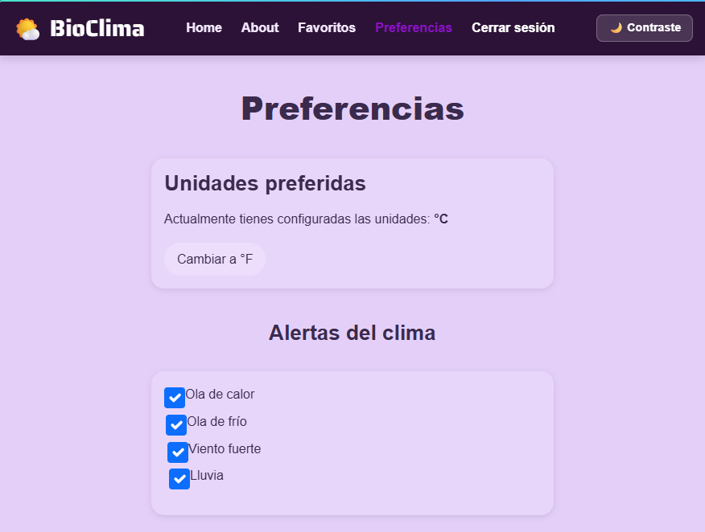

### Login y registro
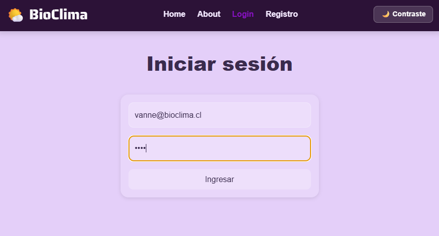
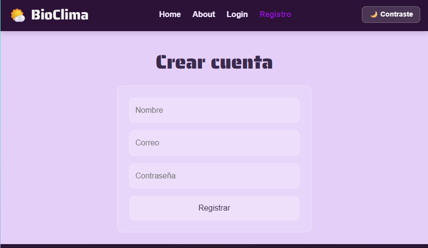

### About y contacto
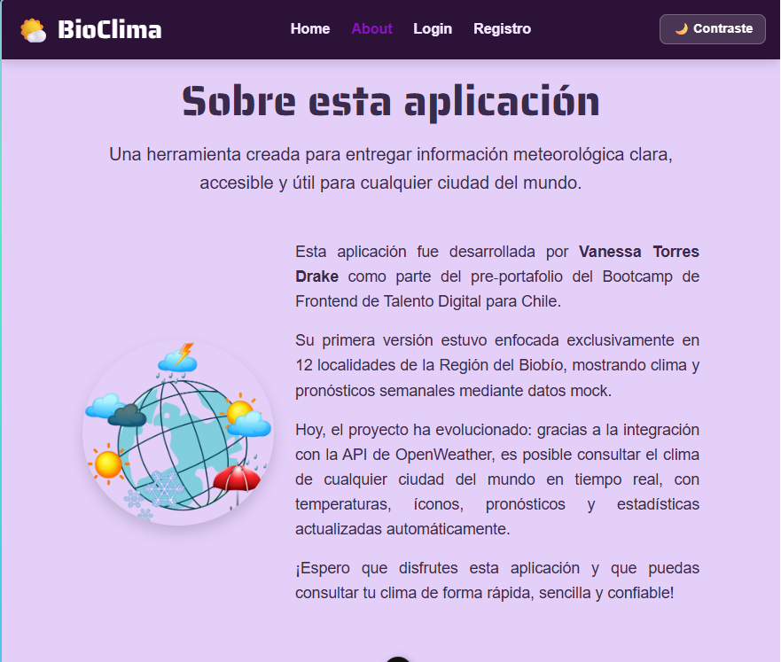
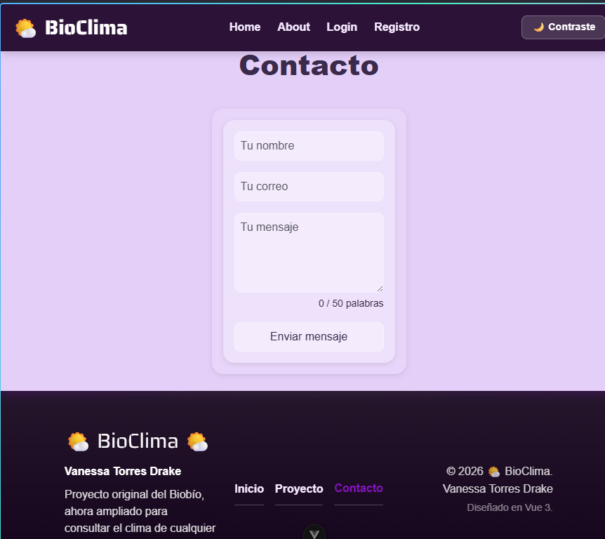

## 🌐 Despliegue web

La aplicación puede publicarse en Vercel o Netlify usando la build de producción.

Pasos recomendados:

1. Ejecuta la build:

```bash
npm run build
```

2. Sube el proyecto a tu plataforma de despliegue.
3. Configura la variable de entorno `VITE_WEATHER_API_KEY` en el panel de despliegue.
4. Verifica que la SPA cargue correctamente y que las rutas funcionen.
5. Agrega aquí el enlace final cuando esté publicada:

```text
https://weather-app-frontend-theta-beige.vercel.app/
```

## 📚 Aprendizajes

- Migración de JS vanilla a Vue 3
- Componentización y reutilización
- Manejo de estado global con Pinia
- Rutas protegidas y autenticación
- Arquitectura SCSS 7‑1
- Integración de API en tiempo real
- Cálculo de estadísticas y alertas
- Persistencia en localStorage
- Diseño responsivo y moderno
- Deploy profesional
- Buenas prácticas de arquitectura front-end

## 🧪 Verificación

Para comprobar que el proyecto compila correctamente:

```bash
npm run build
```

## 👩‍💻 Autor

Vanessa Torres Drake  
Bootcamp Front End Trainee – Talento Digital para Chile  
Junio 2026